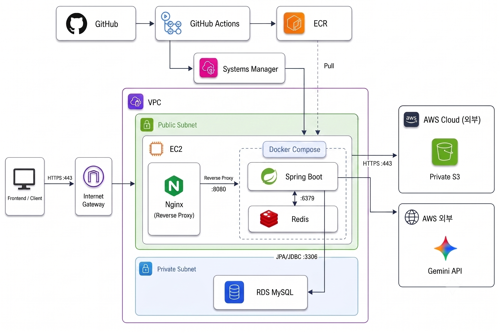

# OMO Backend

> **말하면 찾아주고, 고르면 준비된다.**

> 자연어 AI 검색으로 해외 체류 도시를 추천하고, 도시 비교부터 출국 준비 로드맵까지 통합 관리하는 해외 준비 플랫폼입니다.

## 서비스 소개

해외 체류를 준비할 때는 도시별 생활비와 치안, 비자, 언어 환경을 여러 출처에서 확인하고 출국 일정과 필요 서류를 별도로 관리해야 합니다. OMO는 이러한 탐색과 준비 과정을 하나의 서비스로 연결합니다.

사용자는 원하는 조건을 자연어로 입력해 적합한 도시를 추천받고, 도시별 정보와 장단점을 비교할 수 있습니다. 도시를 선택한 이후에는 체류 목적에 맞는 로드맵을 생성하여 준비 태스크, 필요 문서, 일정과 예산을 관리할 수 있습니다.

이 저장소는 OMO의 REST API, 인증, AI 브리핑, 로드맵, 파일 업로드 및 배포 구성을 담당하는 백엔드 프로젝트입니다.

## MVP 기능

- **AI 도시 추천**: 자연어에서 예산, 치안, 언어, 비자, 주거 및 인프라 조건을 추출해 적합한 도시 추천
- **도시 탐색 및 비교**: 도시 핵심 정보, 장단점, 통계, 후기와 참고 자료를 조회하고 복수 도시 비교
- **관심 도시 관리**: 관심 있는 도시를 저장하고 마이홈에서 목록 확인
- **맞춤형 로드맵 생성**: 선택한 도시와 체류 목적에 맞는 준비 로드맵과 태스크 자동 생성
- **출국 준비 관리**: 태스크 선행 관계, 일정, D-Day, 필요 문서, 진행률 및 예산 관리
- **회원 및 인증**: 이메일 회원가입·로그인, 이메일 인증, Google OAuth 로그인 및 JWT 인증

## 부가 기능

- **AI 이어 묻기**: 이전 검색 조건을 세션에 누적하여 추가 조건으로 결과 구체화
- **조건 완화 제안**: 검색 결과가 없을 때 적용 가능한 조건 완화와 재검색 문장 제공
- **비동기 브리핑 조회**: `taskId`를 이용해 AI 작업 상태와 완료 결과 조회
- **도시 비교 목록**: 비교할 도시를 별도 목록으로 등록·삭제
- **Google 계정 관리**: 기존 회원의 Google 계정 연결 상태 조회 및 연결·해제
- **프로필 이미지 관리**: Presigned URL 기반 S3 직접 업로드, 교체 및 삭제
- **문의 및 첨부파일**: 업로드 세션을 이용한 문의 첨부파일 등록과 검증
- **회원 설정**: 프로필, 비밀번호 및 알림 수신 설정 관리

## 기술 스택

| 구분 | 기술 |
| --- | --- |
| Language | Java 21 |
| Framework | Spring Boot 4.1, Spring MVC, Spring Validation |
| Data | Spring Data JPA, Hibernate, MySQL 8.4 |
| Cache / State | Redis 7.4 |
| Security | Spring Security, JWT, Google OAuth 2.0 |
| AI | Google Gemini API |
| Storage | AWS S3, Presigned URL |
| API / Monitoring | Springdoc OpenAPI, Swagger UI, Spring Boot Actuator |
| Test | JUnit Platform, H2 |
| Build / Runtime | Gradle 9.5.1, Docker, Docker Compose, Eclipse Temurin 21 JRE |
| CI/CD | GitHub Actions, Amazon ECR, AWS Systems Manager |
| Infrastructure / HTTPS | AWS EC2, RDS MySQL, Nginx, Let's Encrypt(Certbot), CloudWatch Logs |

## 서버 아키텍처

<p align="center">
  
</p>

GitHub Actions와 Amazon ECR·AWS Systems Manager를 통해 EC2에 배포합니다. 외부 요청은 `https://omo.ai.kr`의 Nginx에서 TLS를 종료한 뒤 Docker Compose로 실행되는 Spring Boot `:8080`으로 전달됩니다. Spring Boot는 Redis, RDS MySQL, Private S3 및 Gemini API와 연동되며, 애플리케이션 로그는 CloudWatch Logs에서 확인합니다. HTTPS 인증서는 Let's Encrypt와 Certbot으로 발급하고 자동 갱신합니다.

## 주요 설계

### AI 브리핑 비동기 처리

AI 분석 시간 동안 HTTP 연결을 유지하지 않도록 요청 접수와 결과 조회를 분리했습니다.

```text
POST /api/v1/ai-search/briefing
        │
        ├─ 검색 세션·로그 저장
        ├─ Redis: PROCESSING (TTL 30분)
        └─ sessionId, taskId 즉시 반환
                │
                ▼ AFTER_COMMIT + @Async
        Gemini 분석 및 DB 결과 저장
                │
                ├─ 성공: Redis COMPLETED
                └─ 실패: Redis FAILED

GET /api/v1/ai-search/briefing/status/{taskId}
        └─ 상태 및 완료 결과 조회
```

트랜잭션 커밋 후 이벤트를 처리하여 비동기 작업이 아직 저장되지 않은 세션이나 검색 로그를 조회하지 않도록 했습니다.

### SPA 환경의 Google OAuth 인증 전달

OAuth Callback URL에 JWT를 직접 노출하지 않습니다. Redis에 OAuth 목적과 `state`를 5분간 보관하고, Callback에서 조회와 동시에 삭제해 재사용을 방지합니다. 인증 성공 후에는 3분 동안 유효한 일회용 티켓만 SPA에 전달하며, 티켓 교환 API가 이를 원자적으로 소비한 뒤 JWT를 발급합니다.

### Presigned URL 기반 파일 업로드

파일 바이너리가 백엔드를 경유하지 않고 클라이언트에서 S3로 직접 전송됩니다. 백엔드는 업로드 URL 발급 전에 요청 정보를 검사하고, 등록 시 S3 `HEAD` 요청으로 객체의 실제 존재 여부, MIME 타입 및 크기를 다시 검증합니다. DB에는 만료되는 URL 대신 영구 식별자인 Object Key와 필요한 메타데이터를 저장합니다.

### 의존성 기반 로드맵 생성

도시·목적별 템플릿에서 로드맵, 태스크, 선행 관계와 준비 문서를 하나의 트랜잭션으로 생성합니다. 템플릿 의존성을 그래프로 구성하고 DFS로 자기 참조, 중복 관계 및 순환 참조를 검증합니다. 생성 이후에는 선행 태스크 완료 여부에 따라 후속 태스크의 `LOCKED`, `PENDING`, `IN_PROGRESS`, `COMPLETED` 상태를 계산합니다.

### 데이터 ETL 파이프라인

재외동포청, 고용노동부, 외교부 등 14개 출처의 데이터를 수집해 전처리, 통합, SQL 변환 및 DB 적재 과정을 구성했습니다. Python으로 누락값을 보완하고 형식과 단위를 정규화한 뒤 `city_id`를 기준으로 데이터를 통합했습니다. 변환 결과는 원본과 교차 검증하고 SQL `INSERT`문 형태의 시드 데이터로 생성했습니다.

## 프로젝트 구조

```text
src/main/java/com/omo/backend
├── common                    # 공통 엔티티
├── domain
│   ├── aisearch              # AI 검색·비동기 브리핑
│   ├── auth                  # 로그인·OAuth·이메일 인증
│   ├── budget                # 로드맵 예산
│   ├── city / country        # 국가·도시
│   ├── document              # 준비 문서
│   ├── inquiry               # 문의·첨부파일
│   ├── member                # 회원·프로필·설정
│   ├── myhome                # 사용자 홈 요약
│   ├── purpose               # 체류 목적
│   ├── report                # 도시 리포트·비교
│   ├── roadmap               # 로드맵 생성·조회
│   ├── task                  # 태스크·의존성
│   ├── terms                 # 약관
│   └── wishlist              # 관심 도시
└── global
    ├── apiPayload            # 공통 응답·예외 처리
    ├── config                # Security·Swagger·S3 설정
    ├── security              # JWT 인증 필터
    └── storage               # S3·파일 검증
```

각 도메인은 역할에 따라 `controller`, `service`, `repository`, `entity`, `dto`, `converter`, `exception` 패키지로 구성됩니다.

## API 개요

| 영역 | Base Path | 설명 |
| --- | --- | --- |
| 인증 | `/auth/v1` | 이메일 인증, 로그인, OAuth, 토큰 재발급·로그아웃 |
| 회원 | `/api/v1/members` | 회원가입, 내 정보, 계정 연결, 프로필 및 설정 |
| AI 검색 | `/api/v1/ai-search` | 추천 프롬프트, 브리핑 요청·조회, 세션 삭제 |
| 도시 | `/api/v1/cities` | 도시 검색, 리포트, 비교 |
| 국가·목적 | `/api/v1/countries`, `/api/v1/purposes` | 검색 조건 목록 |
| 로드맵 | `/api/v1/roadmaps` | 생성, 상세 조회, 일정·예산 관리, 삭제 |
| 태스크·문서 | `/api/v1/tasks`, `/api/v1/task-documents` | 태스크 상세·완료·일정 및 문서 체크 |
| 관심 도시 | `/api/v1/wishlist` | 관심 도시 등록·삭제 |
| 비교 목록 | `/api/v1/members/me/compare-items` | 비교 도시 관리 |
| 마이홈 | `/api/v1/my-home` | 내 로드맵·관심 도시 요약 |
| 문의 | `/api/v1/inquiries` | 문의 등록 및 첨부파일 URL 발급 |
| 약관 | `/api/v1/terms` | 약관 조회 |

상세 요청·응답 형식은 Swagger UI에서 확인할 수 있습니다.

### 개발·데모 서버

- API Base URL: `https://omo.ai.kr`
- Swagger UI: `https://omo.ai.kr/swagger-ui/index.html`
- Health Check: `https://omo.ai.kr/actuator/health`

### 로컬 환경

- API Base URL: `http://localhost:8080`
- Swagger UI: `http://localhost:8080/swagger-ui/index.html`
- Health Check: `http://localhost:8080/actuator/health`

## CI/CD

- `main` 또는 `develop` 대상 Pull Request: 테스트 및 애플리케이션 빌드
- `develop` 브랜치 Push: 테스트·빌드 후 Docker 이미지 생성 및 Amazon ECR Push
- AWS Systems Manager Run Command: EC2에서 새 이미지 Pull 및 컨테이너 재시작
- Actuator Health Check: 배포 후 애플리케이션 상태 검증
- Nginx Reverse Proxy: HTTPS `:443` 요청을 Spring Boot `:8080`으로 전달하고 HTTP 요청을 HTTPS로 리다이렉트
- Let's Encrypt(Certbot): TLS 인증서 발급 및 자동 갱신
- CloudWatch Logs: Spring Boot 컨테이너 로그 수집 및 조회

개발·시연 서버는 직접 SSH 접속 대신 AWS Systems Manager를 통해 배포 명령을 전달하도록 구성되어 있습니다. 외부에서는 Nginx를 통해 HTTPS로 접근하며 Spring Boot의 `8080` 포트는 직접 공개하지 않습니다.
